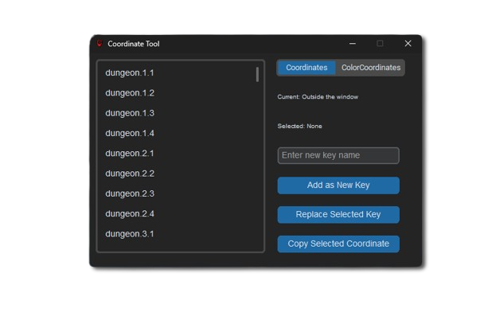

# Developer Guide - BitHeroes-Bot
Welcome! Interested in contributing to BitHeroes-Bot? This guide will walk you through everything you need to get started as a developer.

## 📋Prerequisites
- **Python 3.8+** - Required for running the bot
- **Visual Studio Code** - Recommended IDE (this repository includes VS Code configuration)
- **Git** - For version control

## 🛠️ Setup

1. **Fork the repository** on GitHub.
    ```bash
    git clone https://github.com/<your-username>/BitHeroes-Bot.git
    cd BitHeroes-Bot
    ```
1. (Recommended) Create and activate a [virtual environment](https://docs.python.org/3/library/venv.html).
1. **Install dependencies:**
    ```bash
    pip install -r requirements.txt
    ```
6. **Install dependencies:**
   ```bash
   pip install -r requirements.txt
   ```

**Troubleshooting:**  
- If `python` is not found, try `python3`.
- If `pip` is missing, install it with `python -m ensurepip`.
- If activation fails on Windows, ensure you are using PowerShell or CMD.

---

## 📂 Project Structure
- `core/`: Main bot logic and features.
- `data/`: Persistent data storage.
- `gui/`: User interface components.
- `scripts/`: Developer tools and utility scripts.
- `tests/`: Automated tests.
- `BitHeroesBot.py`: Application entry point.

## 🚀 Contributing
1. Make a fork
1. Create a new branch for your feature or fix:
   ```bash
   git checkout -b feature/my-feature
   ```
1. Try to follow this repo naming style and leave helpful commit messages
1. Submit a Pull Request to the main branch

## 📜 Scripts

- 📍 **`CoordinateTool.py`**: A mini-app for capturing in-game coordinates. Launch the game from the BitHeroes-Bot app, right-click to add a new coordinate, and automatically generate the `core/constants/GeneratedCoordinates.py` file.
  
  <p align="center">
    
  </p>

- 🌐 **`FamiliarParser.py`**: Parses data from the HTML file at `scripts/familiar_parser/wiki.html`. This script is still in use as not all required information for raids and other features has been scraped. It will need updates when adding auto-raid or similar features.

- 📦 **`Builder.py`**: Packages the project into a `.exe` file for a release.

Feel free to contribute new scripts or suggest improvements to existing ones!

**How to run a script:**
1. Open the Command Palette (`Ctrl+Shift+P`).
2. Type and select `Tasks: Run Task`.
3. Choose the desired script from the list (e.g., `CoordinateTool`, `FamiliarParser`, or `Builder`).

## 🧪 Testing
We currently need automated tests. Creating a UI mock for testing features would also be valuable. If you have experience with testing frameworks or UI prototyping, your contributions are welcome!
- Automated tests should go in the `tests/` folder.
- Use the framework `pytest` for Python tests.
- UI mockups and automated UI tests are welcome.
- Run all tests before merging changes.

## 🙏 Contributions Needed
- Completing all [planned features](https://github.com/users/elwoujdi/projects/2/views/6) for the version 2 release
- Fixing bugs and improving performance
- Expanding automated test coverage
- Optimizing the user interface and user experience
- Reviewing and refactoring existing code
- Suggesting and implementing new features
- Providing feedback on pull requests

### [Join our Discord !](https://discord.gg/EzMjmVjQ)  
If you're contributing, let me know so I can assign you the Developer role. This will give you access to our developer chat, where you can get help and collaborate with other contributors.

